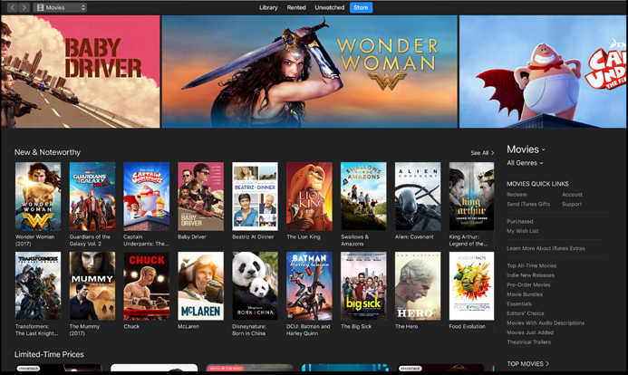

# zupaTech Web Developer Test

This test is used as part of the recruitment process for web developers looking to join zupaTech. We would expect this to normally take between one and three hours to complete, however there is no fixed time limit and you may spend as long as you wish.

Your code should be written in a way that shows you have a good understanding of modern web design patterns and best practices such as responsive design, graceful degradation/progressive enhancement, HTML5 semantic structure and accessibility. When you are finished you should submit a link to your repository (GitHub, GitLab, BitBucket, etc) or provide us with the source code.

If you believe the test is unclear in anyway or you have any questions please ask.

## Test

We want to create a new website which allows users to directly stream different media we have licensed, a mixture of movies, television and music. Using the design below we want you to create the homepage. The 'hero' images at the top of the page should rotate between our new releases, clicking on an image should bring up a modal showing the media and a short description and the page should work well on a series of different screen sizes and devices.

For the purposes of this test, the content can be entirely static, only the home page needs to be created, the links to other content, do not need to be functional and we are only targeting the Chrome browser.